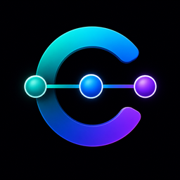

# CONTINUUM

<p align="center"></p>

**Provider-neutral AI development continuity and token-efficiency infrastructure.**

CONTINUUM lets you run several coding agents — Claude Code, DeepSeek, Codex, or any
OpenAI/Anthropic-compatible API — from one interface, and hand a task from one agent to
another mid-flight without losing context. You aren't restricted to the providers we use:
CONTINUUM ships bundled providers *plus* user-defined compatible CLI/API providers, so you
can configure Claude, Codex, DeepSeek, Grok, GLM, or other compatible systems.

Major capabilities:

- persistent memory / context
- shorter repeated prompts
- cross-provider agent handoff
- native CLI session continuity
- arbitrary provider manifests
- API-agent runtime
- MCP integration
- health / recovery
- repo intelligence
- tool-output optimization
- deterministic tool-result caching
- reversible context pruning

Measured on a representative CONTINUUM coding task: **6,167 → 4,734** estimated model input
tokens (**−23.2%**), tool executions **16 → 10**, with **no measured fidelity regression**.
That is a measured representative benchmark, **not** a universal savings guarantee.

> **Beta.** This is `v0.1.0-beta.1`. It works on macOS (most-tested), with
> Windows/Linux credential backends implemented but less exercised. See
> [Beta limitations](#beta-limitations).

## Why CONTINUUM exists

CONTINUUM exists because we realized that many people building with AI are ultimately
trying to solve the same problems.

Across GitHub, some excellent solutions already existed — but the ideas were scattered
across separate projects. One project approached persistent memory well, another reduced
tool-output tokens, another improved repository context, while others explored caching,
context pruning, prompt efficiency, or related problems.

Instead of pretending those ideas did not exist, we studied them, learned from them,
credited them, and independently implemented the concepts that made sense inside one
common architecture.

CONTINUUM is our attempt to turn those scattered ideas into one practical product: a
provider-neutral environment where people can use the AI models and tools they prefer,
preserve useful memory and task state, switch agents without starting over, keep prompts
shorter, and reduce unnecessary token usage.

We believe open source moves forward when good ideas are acknowledged, improved,
combined, and shared again. The projects that influenced CONTINUUM are openly credited
in [Projects we learned from](#projects-we-learned-from) and in our provenance documentation.

The goal is simple:

- Stop making AI start over.
- Stop repeatedly explaining the same project.
- Stop wasting tokens rebuilding context the system could have remembered.

CONTINUUM's contribution is the unified product and architecture — not a claim that every
underlying idea originated here.

## Quick start

```bash
git clone https://github.com/AShakeel786/CONTINUUM
cd CONTINUUM
npm ci                 # install dev + runtime deps
npm run build          # compile to dist/

node dist/cli/bin.js setup              # first-run onboarding (credential backend + providers + MCP consent)
node dist/cli/bin.js project add <name> <path> --provider claude   # register a project
node dist/cli/bin.js launch <project>   # resolve project → provider → session → run the agent
node dist/cli/bin.js resume <session>   # resume a session (stale-worktree safe; resumes the agent's native session)
node dist/cli/bin.js handoff <session>  # hand off to an authenticated agent (never auto-selects)
node dist/cli/bin.js sessions           # list recent sessions
node dist/cli/bin.js doctor             # read-only health report (exit 0 = healthy)
```

After `npm run build` you can also install the two CLIs locally with
`npm install -g .` (exposes `continuum` and `continuum-mcp`), or keep using
`node dist/cli/bin.js`.

## Bundled providers

| id | provider | how it runs |
|---|---|---|
| `claude` | Claude Code | native CLI (its own `claude` login) |
| `deepseek` | DeepSeek | Claude Code routed through the Tencent MemoryProxy |
| `codex` | Codex | native CLI (its own `codex` login) |

Set up auth with `continuum auth <id>` (masked prompt; the key is stored in your
OS credential store, never in a config file).

## Adding your own provider

Any OpenAI-compatible or Anthropic-compatible API — or a CLI you already use —
can be added as a secret-free JSON manifest under `~/.continuum/providers/`, with
no source edits:

```bash
# OpenAI-compatible API (e.g. Grok / GLM / most vendors)
node dist/cli/bin.js provider add --id grok --protocol openai-compatible \
  --base-url https://api.x.ai/v1 --auth api-key --env XAI_API_KEY --model grok-3
node dist/cli/bin.js auth grok        # store the API key (env-var NAME only, never the value)
node dist/cli/bin.js provider list    # shows Runtime: Native CLI | CONTINUUM API

# a CLI-based provider
node dist/cli/bin.js provider add --id mycli --protocol openai-compatible \
  --base-url https://api.example.com --auth cli-session --model my-model --cli mycli
```

API-only providers run through CONTINUUM's built-in agent loop (model → tool →
result → model); CLI providers use their native binary. A provider's runtime is
selected entirely from its manifest capabilities.

## Core concepts

- **Credentials** — stored in an OS-native backend (macOS Keychain / Windows
  DPAPI / Linux Secret Service, with an AES-256-GCM encrypted-file fallback).
  Config records only `credential://` references, never values.
- **MCP** — `continuum mcp` is a dependency-free JSON-RPC stdio server over
  memory + session tools; `continuum mcp-setup` registers it with Claude/Codex.
- **Memory** — optional: if the Tencent memory stack (Docker
  `tdai-memory-core`/`tdai-proxy`/`tdai-memory-hub`) is running, agents get
  shared persistent memory; without it, CONTINUUM degrades to local session
  context only.
- **Sessions & handoff** — a durable `TaskSession` records work *during* a task;
  `handoff` flushes it into a token-budgeted package so the receiving agent
  continues instead of re-auditing. Handoff never auto-selects the receiving
  agent.
- **doctor** — read-only health (auth, runtime stack, MCP, provider contracts);
  `doctor --repair` performs explicit, bounded recovery.

## Beta limitations

- macOS is the most-tested platform; Windows/Linux credential backends are
  implemented but not yet exercised against a live machine.
- API-agent responses are non-streaming.
- The Tencent memory stack is a separate, optional component.
- No npm-registry distribution yet — this is a clone-and-build beta.
- No UI.

## Token efficiency (built in)

Four fail-closed optimizations ship on by default and are independently disableable:

- **Tool Output Optimizer** — deterministic, lossless-first compaction of tool results
  (errors/stack traces preserved; raw output retained and retrievable).
- **Repo Intelligence Map** — a token-budgeted, task-relevant codebase map (navigation only).
- **Deterministic Tool Result Cache** — caches read-only deterministic tools, keyed by repo/session
  fingerprint (write + mutable-memory tools never cached).
- **Reversible Context Pruning** — externalizes pruned context so nothing is lost, retrievable on demand.

On a representative task these together measured a ~23% reduction in estimated input tokens
(6,167 → 4,734) and fewer tool executions (16 → 10), with no fidelity regression — see
[`docs/TOKEN_EFFICIENCY_FINAL_BENCHMARK.md`](docs/TOKEN_EFFICIENCY_FINAL_BENCHMARK.md). That figure is
one measured task, not a universal guarantee.

## License

MIT — see [`LICENSE`](LICENSE). Third-party attributions are in [`THIRD_PARTY_NOTICES`](THIRD_PARTY_NOTICES).

## Projects we learned from

CONTINUUM's implementation is our own unified architecture; several open-source projects
influenced the concepts we studied and independently reimplemented. We credit them here
openly (the full, precise provenance analysis is in
[`docs/THIRD_PARTY_PROVENANCE_AUDIT.md`](docs/THIRD_PARTY_PROVENANCE_AUDIT.md) and
[`docs/LICENSE_COMPATIBILITY_MATRIX.md`](docs/LICENSE_COMPATIBILITY_MATRIX.md)).

| Project | License | What we studied | Relationship |
|---|---|---|---|
| [TencentDB-Agent-Memory](https://github.com/Tencent/TencentDB-Agent-Memory) | MIT | persistent memory (L0–L3), the stable/dynamic context split, the `/v3` gateway wire contract | architectural inspiration / independently reimplemented concepts |
| [rtk-ai/rtk](https://github.com/rtk-ai/rtk) | Apache-2.0 | per-command tool-output compression + honest telemetry | independently reimplemented concept |
| [Aider-AI/aider](https://github.com/Aider-AI/aider) | Apache-2.0 | tree-sitter repo map with relevance ranking | independently reimplemented concept |
| [headroomlabs-ai/headroom](https://github.com/headroomlabs-ai/headroom) | Apache-2.0 | reversible, content-aware context compression | research/reference only |
| [zilliztech/GPTCache](https://github.com/zilliztech/GPTCache) | MIT | semantic LLM response caching (evaluated, then rejected for coding-agent false-positive risk) | research/reference only |
| [open-compress/claw-compactor](https://github.com/open-compress/claw-compactor) | MIT | reversible compression + AST-aware analysis | research/reference only |
| [microsoft/LLMLingua](https://github.com/microsoft/LLMLingua) | MIT | lossy model-based prompt compression (evaluated, then rejected for code-fidelity risk) | research/reference only |
| [zilliztech/claude-context](https://github.com/zilliztech/claude-context) | MIT | semantic codebase indexing | research/reference only |
| [ojuschugh1/sqz](https://github.com/ojuschugh1/sqz) | Elastic License 2.0 | lossy context compression + dedup | **research/idea reference only — no source incorporated** |
| [Opencode-DCP/opencode-dynamic-context-pruning](https://github.com/Opencode-DCP/opencode-dynamic-context-pruning) | AGPL-3.0 | dynamic conversation context pruning | **research/idea reference only — no source incorporated** |

Every implementation here is CONTINUUM's own; "independently reimplemented" means the
*concept* was studied, not the source. `sqz` (ELv2) and `opencode-dcp` (AGPL-3.0) were read
for ideas only — their source is not incorporated, and neither imposes obligations on CONTINUUM.

## Development docs

Design + phase-by-phase verification lives in [`docs/`](docs/); the architecture
overview is [`docs/CONTINUUM_ARCHITECTURE.md`](docs/CONTINUUM_ARCHITECTURE.md),
and the release assessment is
[`docs/RELEASE_READINESS.md`](docs/RELEASE_READINESS.md).

## Relationship to Tencent

CONTINUUM reuses [TencentDB Agent Memory](https://github.com/Tencent/TencentDB-Agent-Memory)
(`MemoryCore`/`MemoryProxy`) as its optional memory/context infrastructure layer,
and adds agent handoff, unified context assembly, a multi-provider abstraction,
and the MCP/tool layer on top.
